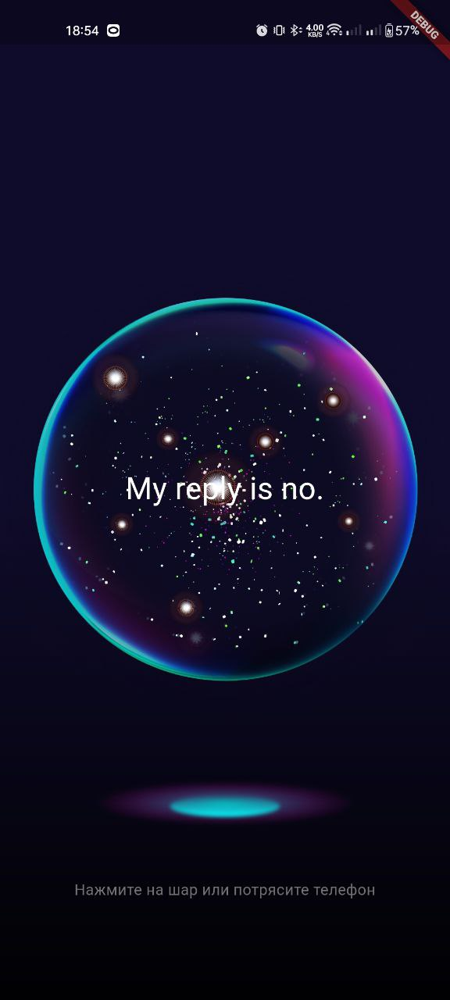
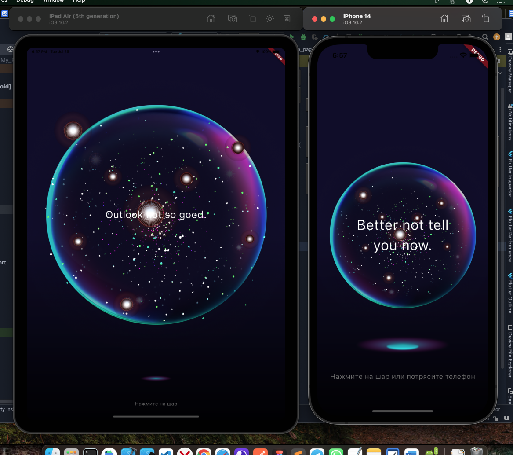
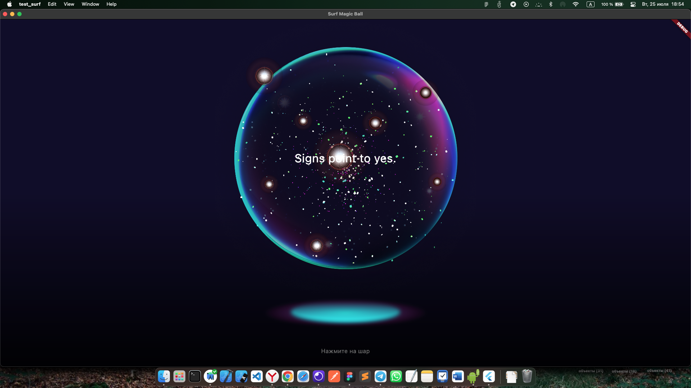
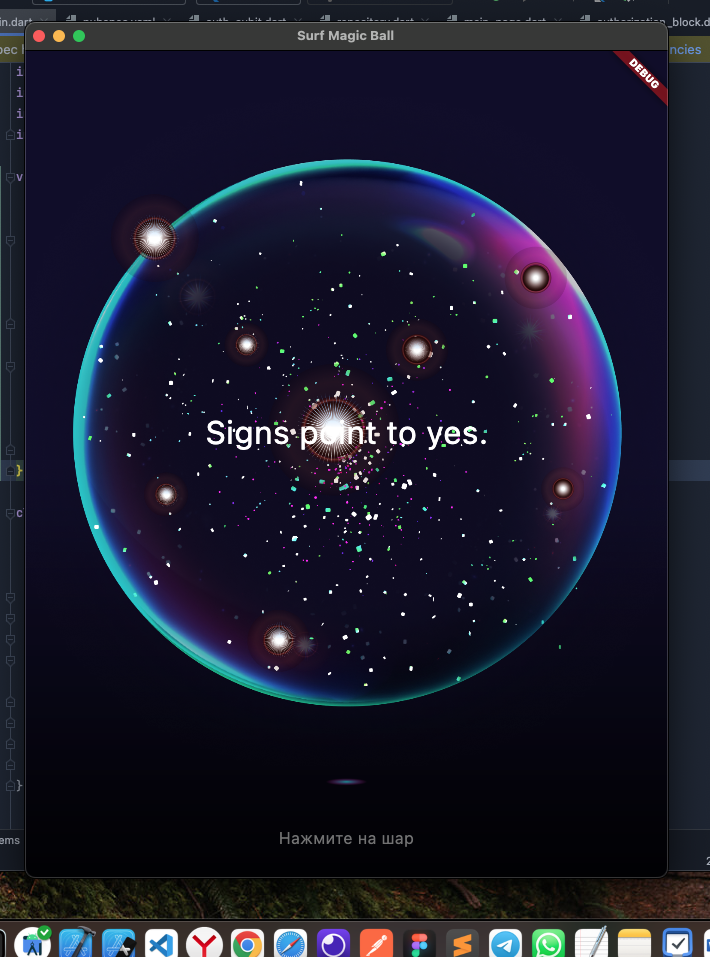
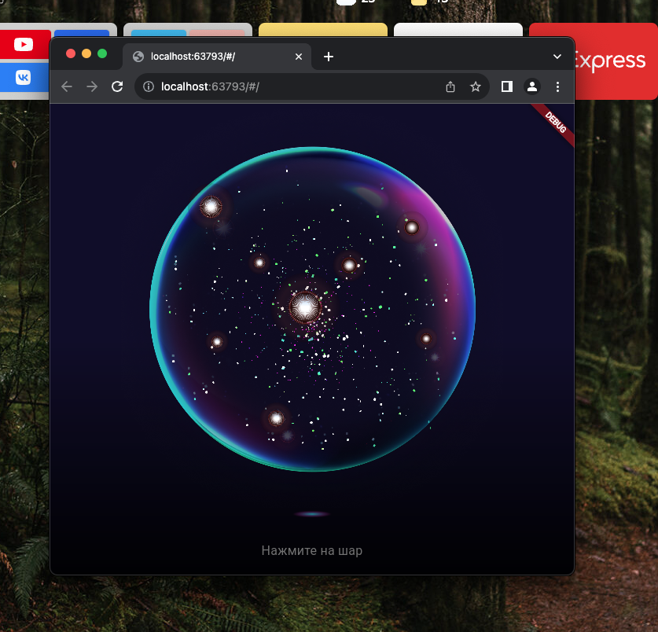

# Целевая платформа

[здесь вставьте платформу/платформы под которые вы разрабатывали, это поможет нам при проверке заданий]

Адаптировал под web (не работает запрос в сеть), windows, macos, android, ios, ipad

# Результаты

[здесь можете похвастаться, что успели реализовать или сделали что-то сверх задания]

Все что успел сделать:
 Задание 1

Реализуйте интерфейс экрана с магическим шаром.

 Задание 2

Реализуйте бизнес-логику нажатия на шар для получения ответа. Используйте мок-данные для отображения.

 Задание 3

Добавьте логику для обработки пользовательского вопроса и получения ответа от API.

При нажатии на шар отправьте GET-запрос к API и получите ответ.
Обработайте успешный ответ от API и отобразите его внутри магического шара.
Обработайте ошибочный ответ от API и отобразите сообщение об ошибке внутри магического шара.

 Задание 4

Реализуйте отправку запроса при тряске телефона.

 Задание 5

Адаптируйте приложения для запуска на десктоп/веб-платформах, а также планшетах.

 Задание 6 🔥

Добавьте анимацию движения шара:
- при обычном состоянии шар должен плавно парить вверх-вниз
- шар отбрасывает цветную тень

# Ссылки на демонстрацию работы/скриншоты

[здесь оставьте ссылки на скринкаст/скриншоты, можно в Github-репозитории или в отдельном обалке]

